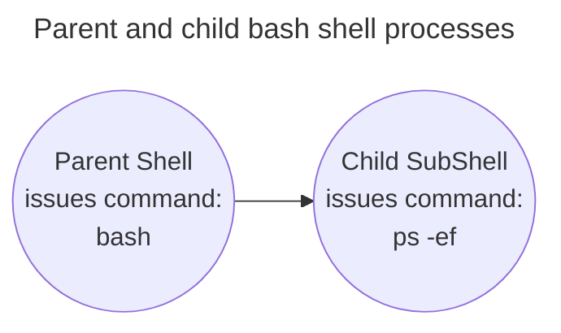

# Exploring Shell Types
---
The shell program that the system starts depends on our user ID configuration. In the /etc/
passwd file, the user ID has its default shell program listed in field #7 of its record. We can verify it by:
```bash
cat /etc/passwd | grep '/home/<username>'
```

> The bash shell program resides in the /bin directory.

```bash
ls -lF /bin/bash
```

The default interactive shell starts whenever a user logs into a virtual console terminal or starts a terminal emulator in the GUI. However, another default shell, /bin/sh, is the default system shell. The default system shell is used for system shell scripts, such as those needed at startup.
```bash
$ ls -l /bin/sh
lrwxrwxrwx 1 root root 4 Mar 27 15:03 /bin/sh -> dash
```

> We can run the dash shell directly by

```bash
/bin/bash

exit  #to exit the shell 
```

# Exploring Parent and Child Shell Relationships
---
The default interactive shell started when a user logs into a virtual console terminal or starts a terminal emulator in the GUI is a *parent shell*.

When the /bin/bash command or the equivalent bash command is entered at the CLI prompt, a new shell program is created. This is a child shell. A child shell also has a CLI prompt and waits for commands to be entered.


When a child shell process is spawned, only some of the parent’s environment is copied to
the child shell environment. A child shell is also called a *sub shell*. A sub shell can be created from a parent shell, and a sub shell can be created from another sub shell.

We can gracefully exit out of each sub shell by entering the exit command. Not only does the exit command allow us to leave child sub shells, but we can also log out of your current virtual console terminal or terminal emulation software as well.

Also, you can spawn sub shells without using the bash shell command or running a shell script. One way is by using a process list.

## Looking at process lists
---
> A process list is a command grouping type.

On a single line, we can designate a list of commands to be run one after another. This is done by entering a command list using a semicolon (;) between commands.
```bash
pwd; ls ; cd /etc ; pwd ; cd ; pwd ; ls; echo $BASH_SUBSHELL
```

The commands all executed one after another with no problems. However, this is not a process list. For a command list to be considered a process list, the commands must be encased in parentheses.
```bash
(pwd; ls ; cd /etc ; pwd ; cd ; pwd ; ls; echo $BASH_SUBSHELL)
```

Adding parentheses and turning the command list into a process list created a sub-shell to execute the commands.

To check whether a sub shell is spawned use `BASH_SUBSHELL` command
```bash
echo $BASH_SUBSHELL # gives 0 if not spawned and 1 if spawned.
```

Another command grouping type puts the commands between curly brackets and ends the command list with a semicolon (;). The syntax is as follows: { command; }. Using curly brackets for command grouping does not create a sub-shell as a process list does.

Subshells are often used for multi-processing in shell scripts. However, entering into a sub-
shell is an expensive method and can significantly slow down processing.

# Debunking Sub-Shells
---
At the interactive shell CLI, you have more productive ways to use sub-shells. Process lists,
co-processes, and pipes use sub-shells. One productive subshell method in the interactive shell uses **background mode**.

## Background Mode
---
Running a command in background mode allows the command to be processed and frees up
your CLI for other use.

>The **sleep** command accepts as a parameter the number of seconds you want the process to wait (sleep). This command is often used to introduce pauses in shell scripts.

To put a command into background mode, the `&` character is tacked onto its end.
```bash
sleep 10&
```

> The `jobs` command displays any user’s processes (jobs) currently running in background mode.

```bash
jobs
[1]+ Running       sleep 10&
# -l --> shows PID along with the above information
```

```bash
(sleep 2 ; echo $BASH_SUBSHELL ; sleep 2)&
```
Putting the process list into the background causes a job number and process ID to appear,
and the prompt returns.
## Looking at co-processing
---
> Co-processing spawns a subshell in background mode and executes a command within that subshell.

To perform co-processing, the coproc command is used along with the command to be
executed in the subshell
```bash
coproc sleep 10
```

Co-processing allows you to get very fancy and send/receive information to the process running in the subshell. The only time you need to name a co-process is when you have multiple co-processes running, and you need to communicate with them all. Otherwise, just let the coproc command set the name to the default, COPROC.

# Understanding Shell Built-in Commands
---
> **External Commands**

An *external command*, sometimes also called a file system command, is a program that exists outside of the bash shell. An external command program is typically located in `/bin`, `/usr/bin`, `/sbin, `or `/usr/sbin`.

Whenever an external command is executed, a child process is created. This action is
termed *forking*. Whenever a process must fork, it takes time and effort to set up the new child process’s environment. Thus, external commands can be a little expensive.

**When using a built-in command, no forking is required.**

>**Built-in Commands**

Built-in commands are different in that they do not need a child process to execute. They
were compiled into the shell and thus are part of the shell’s toolkit.

```shell
type <command> # tells us whehter the comd is built-in or external
type -a <command> # shows different flavours of the same cmd.
```

>**History** command

```bash
history <number>
# shows tha last executes commands.
!!
#executes the last esecuted statement.
```
Command history is kept in the hidden `.bash_history` file, which is located in the user’s
home directory.

>The **alias** Command allows us to create an alias name for common commands (along with their parameters) to help keep our typing to a minimum.

An alias is valid only for the shell process in which it is defined.
```bash
alias li='ls -li'

bash

li
bash: li: command not found

exit

```